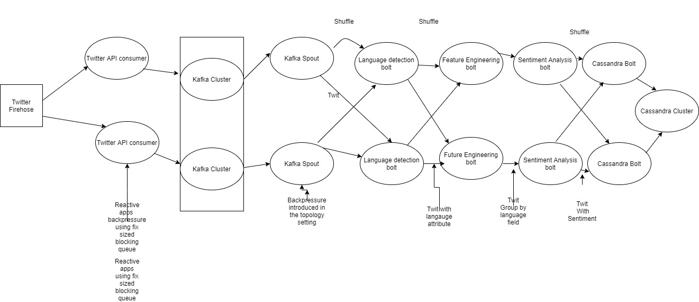

# finder [](https://travis-ci.org/mozammal/finder)
## Requirements

For building and running the application you need:

- [JDK 1.8](http://www.oracle.com/technetwork/java/javase/downloads/jdk8-downloads-2133151.html)
- [Maven 3](https://maven.apache.org)

## Running the application locally

clone the repo with the command given below:
```shell 
git clone https://github.com/mozammal/finder.git
```

One way to run the application is to use use maven to run the application from the command line:

```shell
cd finder
mvn test
```

# Assumptions
 
- array string contains word 
- array string contains no duplicate word
- test cases are provided for edge cases
- test cases are provided for showcasing performance


# Relayr Onboarding Big Data Deep-Dive

### Description
- a real-time architecture for sentiment analysis of twitter data that scales horizontally in Apache Kafka, Storm 
and Cassandra. The proposed system relies asynchronous architecture by introducing durable queuing and stream processing 
that are fault-tolerant and able to withstand very large volume of data. Storm is used in realtime for emitting 
twit into the topology from the kafka cluster, language detection, feature engineering, sentiment analysis, 
and persisting data into the Cassandra cluster. 

# System Diagram
 
 


### Description of libraries/frameworks

- API consumer written in reactive spring for consuming Twitter firehose stream api. Backpressure is achieved 
using fix-sized blocking queue. 
- Apache Kafka is used for reliably moving data to storm applications for further processing. Horizontally scalable.
- Apache Storm is used for processing real-time twits using one-at-a-time processing with lower latency. 
  Storm topology uses a graph with nodes for representing computations and edegs for representing result. 
  Stream groupings are used for routing streams between a spout and bolt or two bolts.
 - Apache Cassandra is used to persist twit with computed sentiment. Cassandra is optimized for write heavy application 
 which is the case for the real-time sentiment analysis of twitter data    
 


